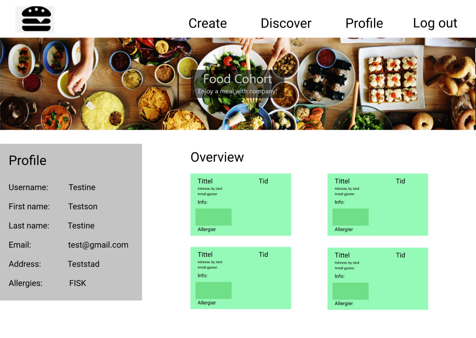

# Food Cohort

Web-application for creating and planning dinners.

 

## Installing dependencies:

We use npm as our package manager, in order to get the app to run and be up to date with the latest dependencies run:

`yarn install`

## Running the app

In the project directory, you can run:

`yarn start`

  
# Finished product

